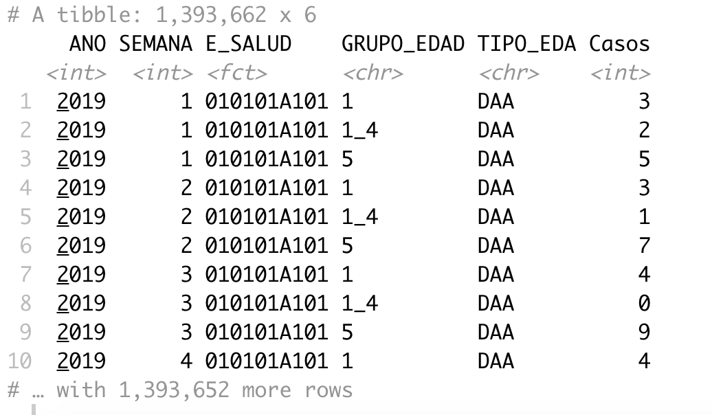
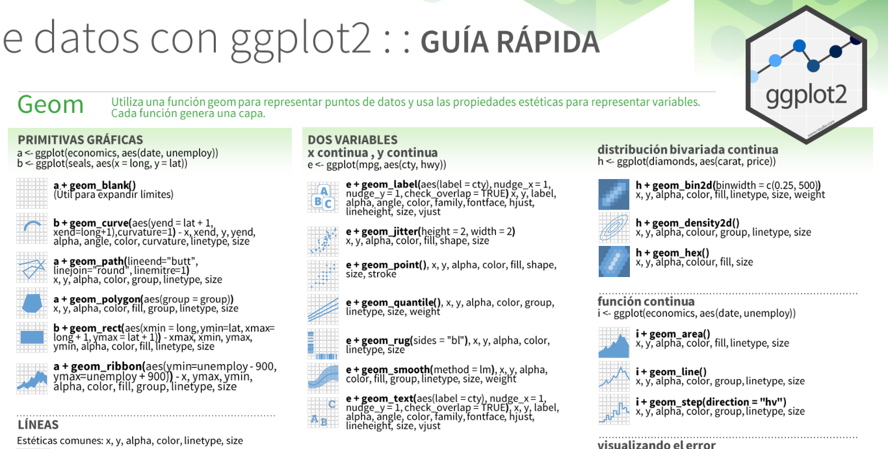

class: inverse, center, middle

```{r setup, include=FALSE}
knitr::opts_chunk$set(fig.dim=c(5.5, 4.5), 
                      # fig.retina=2, 
                      out.width="100%",
                      dev="svg")

library(dplyr)
library(ggplot2)
library(kableExtra)
library(tidyverse,warn.conflicts = F,verbose = F,quietly = T)
library(aweek)
```

```{r,echo=FALSE}
# install.packages("palmerpenguins")
pinguinos <- palmerpenguins::penguins %>% 
  filter(!is.na(bill_length_mm)) %>% 
  select(-flipper_length_mm,-body_mass_g)

data_covid <- read_csv("data/positivos_covid_short.csv",col_types = cols())

# load("data/tvseries_must_watch.rda")
# df <- tvseries_must_watch
# df <- df[!is.na(df$average_rating),] # Remove rows with NA average
```

```{r,eval=FALSE,echo=FALSE}
# <!-- # What is `ggplot2` -->
# 
# <!-- --- -->
# <!-- class: left, top -->
# 
# <!-- ## Why `ggplot2`? -->
# <!-- **`ggplot2`** is a data visualization package for R developed by [Hadley Wickham](https://twitter.com/hadleywickham) that provides a structured approach to graphing.  -->
# 
# <!-- It is a part of the **`tidyverse`**, a collection of R packages that share an underlying design philosophy, grammar and data structures. -->
# 
# <!-- -- -->
# 
# <!-- .pull-left[ -->
# <!-- ### Pros -->
# <!-- + Standardized method for plotting. -->
# <!-- + Publication quality plots. -->
# <!-- + Allows creation of relatively complex plots with ease. -->
# <!-- + Dominant plotting package in R. -->
# 
# <!-- ```{r, echo=FALSE, out.width="40%", fig.align="center"} -->
# <!-- knitr::include_graphics("https://media.giphy.com/media/nsMPhWK6bfxHq/giphy.gif") -->
# <!-- ``` -->
# <!-- ] -->
# 
# <!-- -- -->
# 
# <!-- .pull-right[ -->
# <!-- ### Cons -->
# <!-- - Might be a little bit difficult to understand at the beginning. -->
# <!-- - Sometimes you might get lost between all the things you can change. -->
# 
# <!-- ```{r, echo=FALSE, out.width="40%", fig.align="center"} -->
# <!-- knitr::include_graphics("https://media.giphy.com/media/2FazgxLhFpYv4t93G/giphy.gif") -->
# <!-- ``` -->
# <!-- ] -->
# 
# <!-- --- -->
# <!-- class: left, top -->
# 
# <!-- ## Hands on!  -->
# <!-- ### The dataset -->
# 
# <!-- ```{r, eval=FALSE} -->
# <!-- # install.packages("devtools") # Install devtools -->
# <!-- # devtools::install_github("mireia-bioinfo/tvseries") # Install the package tvseries -->
# <!-- # df <- tvseries::tvseries_must_watch -->
# <!-- load("data/tvseries_must_watch.rda") -->
# <!-- df <- tvseries_must_watch -->
# <!-- df <- df[!is.na(df$average_rating),] # Remove rows with NA average rating -->
# <!-- ``` -->
# 
# <!-- ```{r, echo=FALSE} -->
# <!-- load("data/tvseries_must_watch.rda") -->
# <!-- df <- tvseries_must_watch -->
# <!-- df <- df[!is.na(df$average_rating),] # Remove rows with NA average rating -->
# <!-- df %>% -->
# <!--   kable("html", row.names=FALSE) %>% -->
# <!--   kable_styling(font_size = 10)  %>%  -->
# <!--   scroll_box(height = "300px") -->
# <!-- ``` -->

```

---
class: center, middle

# ¡Los personajes!

```{r, echo=FALSE, fig.cap="", out.width = '70%'}
knitr::include_graphics("https://allisonhorst.github.io/palmerpenguins/man/figures/lter_penguins.png")
```

---
class: center, middle

# ¡Las variables!

```{r, echo=FALSE, fig.cap="", out.width = '60%'}
knitr::include_graphics("https://raw.githubusercontent.com/SamanthaToet/intro-to-flexdashboard/master/culmen_depth.png")
```

---
class: inverse, center, middle

# La gramática de `ggplot2`

<!---------------------------------------- BUILDING PLOTS one layer at a time ----------------------------------->
---
layout: true
class: left, top

## Construyendo gráficos una capa por tiempo

---
.left-code[
```{r gg-canvas0,eval=FALSE}
pinguinos
```

### Data

]
.right-plot[
```{r gg-canvas00,echo=FALSE}
pinguinos %>% 
  kable("html", row.names=FALSE) %>% 
  kable_styling(font_size = 18)  %>%  
  scroll_box(height = "500px")
```
]


---
.left-code[
```{r gg-canvas1, fig.show="hide"}
ggplot(pinguinos)
```

### Data

]
.right-plot[
`)
]

---
.left-code[
```{r gg-canvas2, fig.show="hide"}
ggplot(pinguinos,
      aes(x=bill_length_mm, y=bill_depth_mm, 
          color=species)) 
  
```

#### Data
### Mapeos

]
.right-plot[
`)
]

---
.left-code[
```{r gg-canvas3, fig.show="hide",}
ggplot(pinguinos,
      aes(x=bill_length_mm, y=bill_depth_mm, 
          color=species)) +
    {{geom_point() }}
```

#### Data
#### Mapeos
### Geometrías
]
.right-plot[
`)
]

---
.left-code[
```{r gg-canvas4, fig.show="hide", tidy=FALSE}
ggplot(pinguinos,
      aes(x=bill_length_mm, y=bill_depth_mm, 
          color=species)) +
    geom_point() +
   {{scale_color_brewer(palette="Dark2") }}
```

.pull-left[
#### Data
#### Mapeos
#### Geometrías
### Escalas
]
.pull-right[]
]
.right-plot[
`)
]

---
.left-code[
```{r gg-canvas5, fig.show="hide", tidy=FALSE}
ggplot(pinguinos,
      aes(x=bill_length_mm, y=bill_depth_mm, 
          color=species)) +
    geom_point() +
    scale_color_brewer(palette="Dark2") +
   {{stat_summary(fun="mean", geom= "line") }}
```

.pull-left[
#### Data
#### Mapeos
#### Geometrías
#### Escalas
]
.pull-right[
### Transformaciones estadísticas
]
]
.right-plot[
`)
]

---
.left-code[
```{r gg-canvas6, fig.show="hide", tidy=FALSE}
ggplot(pinguinos,
      aes(x=bill_length_mm, y=bill_depth_mm, 
          color=species)) +
    geom_point() +
    scale_color_brewer(palette="Dark2") +
    stat_summary(fun="mean", geom= "line") + 
   {{coord_flip()}}
```

.pull-left[
#### Data
#### Mapeos
#### Geometrías
#### Escalas
]
.pull-right[
#### Transformaciones estadísticas
### Sistemas de coordenadas
]
]
.right-plot[
`)
]

---
.left-code[
```{r gg-canvas7, fig.show="hide", tidy=FALSE}
ggplot(pinguinos,
      aes(x=bill_length_mm, y=bill_depth_mm, 
          color=species)) +
    geom_point() +
    scale_color_brewer(palette="Dark2") +
    stat_summary(fun="mean", geom= "line") + 
    coord_flip() +
   {{facet_wrap(~species)}}
```

.pull-left[
#### Data
#### Mapeos
#### Geometrías
#### Escalas
]
.pull-right[
#### Transformaciones estadísticas
#### Sistemas de coordenadas
### Paneles (facet)
]
]
.right-plot[
`)
]

---
.left-code[
```{r gg-canvas8, fig.show="hide", tidy=FALSE}
ggplot(pinguinos,
      aes(x=bill_length_mm, y=bill_depth_mm, 
          color=species)) +
    geom_point() +
    scale_color_brewer(palette="Dark2") +
    stat_summary(fun="mean", geom= "line") + 
    coord_flip() +
    facet_wrap(~species) +
   {{theme_bw() + theme(legend.position="top")}}
```

.pull-left[
#### Data
#### Mapeos
#### Geometrías
#### Escalas
]
.pull-right[
#### Transformaciones estadísticas
#### Sistemas de coordenadas
#### Paneles (facet)
### Temas
]
]
.right-plot[
`)
]

---
.left-code[
```{r gg-canvas9, fig.show="hide", tidy=FALSE}
ggplot(pinguinos,
      aes(x=bill_length_mm, y=bill_depth_mm, 
          color=species)) +
    geom_point() +
    scale_color_brewer(palette="Dark2") +
    stat_summary(fun="mean", geom= "line") + 
    coord_flip() +
    facet_wrap(~species) +
    theme_bw() + theme(legend.position="top") +
   {{annotate("text", x=55, y=14.5, label="Pval")}}
```

.pull-left[
#### Data
#### Mapeos
#### Geometrías
#### Escalas
]
.pull-right[
#### Transformaciones estadísticas
#### Sistemas de coordenadas
#### Paneles (facet)
#### Temas
### Anotaciones
]
]
.right-plot[
`)
]


<!---------------------------------------- GGPLOT2 BASICS ----------------------------------->
---
layout: false
class: inverse, middle, center
# ¡Vamos a darle una mirada más de cerca!

---
layout: true
class: left, top

## `ggplot2` básico

---
class: highlight

.left-code[
```{r, eval=FALSE}
ggplot(pinguinos)
```

### Data

]
.right-plot[
`)
]

---

.left-column[

## Data
`ggplot()`

]

.right-column[

El primer paso para graficar es tener tu data en formato __"adecuado"__ (_"tidy"_ o _"limpio"_):

1. Cada __variable__ es una __columna__.
2. Cada __observación__ es una __fila__.

.pull-left[

#### Formato ancho ("sucio") 

ubigeo | casos_JOVEN | casos_ADULTO
-----|---------------|----------------
A	| 3	| 12
B | 6 |	56
C	| 8 |	2

]

.pull-right[

#### Formato largo ("limpio") 

ubigeo | EDAD | casos 
-----|---------|----------
A |	JOVEN | 3
B	| JOVEN | 6
C | JOVEN | 8
A	| ADULTO	| 12
B	| ADULTO	| 56
C	| ADULTO	| 2
]

__¿Por qué?__ ¡Cada columna será una __capa__ del gráfico!

(¿Cómo solucionarlo? ver [**aquí**](https://tidyr.tidyverse.org/reference/pivot_longer.html#examples) una alternativa)

]


---

.left-column[

## Data
`ggplot()`

]

.right-column[

El primer paso para graficar es tener tu data en formato __"limpio"__ (_"tidy"_):

1. Cada __variable__ es una __columna__.
2. Cada __observación__ es una __fila__.

.pull-left[

#### Formato ancho ("sucio") 

ubigeo | IRA_joven | NEU_adulto
-----|---------------|----------------
A	| 3	| 12
B | 6 |	56
C	| 8 |	2

]

.pull-right[

#### Formato largo ("limpio") 

ubigeo | EDAD | casos | Dx
-----|---------|----------|--------
A |	joven | 3 | IRA
B	| joven | 6 | IRA
C | joven | 8 | IRA
A	| adulto	| 12 | NEU
B	| adulto	| 56 | NEU
C	| adulto	| 2 | NEU
]

__¿Por qué?__ ¡Cada columna será una __capa__ del gráfico!

(¿Cómo solucionarlo? ver [**aquí**](https://tidyr.tidyverse.org/reference/pivot_longer.html#examples) una alternativa)

]


---

.left-column[

## Data
`ggplot()`

]

.right-column[

Data en formato __"limpio"__ (_"tidy"_):

1. Cada __variable__ es una __columna__.
2. Cada __observación__ es una __fila__.

__¿Reconoces esta base de datos?__


si __SU OBJETIVO__ es hacer un grafico del numero de casos de EDA (todos los grupos de edad y tipos de edad) por semana

__¿que opina del formato"?__

```{r, echo=FALSE, fig.cap="", out.width = '50%'}
knitr::include_graphics("data/eda2019_cruda.PNG")

```

 
]

---

.left-column[

## Data
`ggplot()`

]

.right-column[

Data en formato __"limpio"__ (_"tidy"_):

1. Cada __variable__ es una __columna__.
2. Cada __observación__ es una __fila__.

__¿Reconoces esta base de datos?__

si __SU OBJETIVO__ es hacer un grafico del numero de casos de EDA (todos los grupos de edad y tipos de edad) por semana

__¿que opina del formato"?__

```{r, echo=FALSE, fig.cap="", out.width = '50%'}


```
]


---

.left-column[

## Data
`ggplot()`

]

.right-column[

Data en formato __"limpio"__ (_"tidy"_):

1. Cada __variable__ es una __columna__.
2. Cada __observación__ es una __fila__.


```{r,echo=TRUE}
pinguinos
```


]

```{r,eval=FALSE,echo=FALSE}
# <!-- --- -->
# <!-- .left-column[ -->
# <!-- ## Data -->
# <!-- `ggplot()` -->
# <!-- ] -->
# 
# <!-- .right-column[ -->
# 
# <!-- The first step for plotting is having your data in a __tidy__ (aka long) format. What does this mean? -->
# 
# <!-- 1. Each __variable__ forms a __column__. -->
# <!-- 2. Each __observación__ forms a __row__. -->
# 
# <!-- You can convert data from **wide** to **long** format using `reshape2::melt()` -->
# <!-- ] -->
```


---
class: highlight

.left-code[
```{r eval=FALSE}
ggplot(pinguinos,
      aes(x=bill_length_mm, y=bill_depth_mm, 
          color=species)) 
  
```

#### Data
### Mapeos

]
.right-plot[
`)
]

---
.left-column[
### Data
## Mapeos
`aes()`
]

.right-column[
El argumento __mapping__ indica cómo mapeamos la __columna de datos__ a elementos visuales o parámetros:

- Variable 1 → **x**
- Variable 2 → **y**
- Variable 3 → **color**, fill, shape, etc.

Los __nombres de columna__:

- Deben especificarse __dentro de la función `aes()`__
- No requieren de comillas :)

Extra:

- La función `aes()` es una contracción de _"aesthetics"_, __Estética__ en español.

```{r,eval=FALSE}
{{ggplot(data = pinguinos, }}
       mapping = aes(x = bill_length_mm, 
                     y = bill_depth_mm, 
                     color = species))
```


]


---
.left-column[
### Data
## Mapeos
`aes()`
]

.right-column[
El argumento __mapping__ indica cómo mapeamos la __columna de datos__ a elementos visuales o parámetros:

- Variable 1 → **x**
- Variable 2 → **y**
- Variable 3 → **color**, fill, shape, etc.

Los __nombres de columna__:

- Deben especificarse __dentro de la función `aes()`__
- No requieren de comillas :)

Extra:

- La función `aes()` es una contracción de _"aesthetics"_, __Estética__ en español.

```{r,eval=FALSE}
{{ggplot(pinguinos, }}
       aes(x = bill_length_mm, 
           y = bill_depth_mm, 
           color = species))
```


]


---
class: highlight

.left-code[
```{r eval=FALSE}
ggplot(pinguinos,
      aes(x=bill_length_mm, y=bill_depth_mm, 
          color=species)) +
    {{geom_point() }}
```

#### Data
#### Mapeos
### Geometrías
]
.right-plot[
`)
]

---
.left-column[
### Data
### Mapeos
## Geometrías
`geom_*()`
]

.right-column[
Las **geometrías** indican cuáles formas geométricas deben ser graficadas usando los parámetros y variables definidas en `aes()`.

```{r geom-point, include=FALSE, fig.show="hide", fig.dim=c(1, .25), dev="svg"} 
ggplot(pinguinos, aes(bill_length_mm, bill_depth_mm, color=species)) +
  geom_point(size=.1) +
  theme_void() + theme(legend.position="none")
```

```{r geom-line, include=FALSE, fig.show="hide", fig.dim=c(1, .25), dev="svg"} 
ggplot(pinguinos, aes(bill_length_mm, bill_depth_mm, color=species)) +
  stat_summary(fun="mean", geom="line") +
  theme_void() + theme(legend.position="none")
```

```{r geom-bar, include=FALSE, fig.show="hide", fig.dim=c(1, .25), dev="svg"} 
ggplot(pinguinos[round(runif(70, min=1, max=nrow(pinguinos))),], aes(species, ..count.., fill=species)) +
  geom_bar() +
  theme_void() + theme(legend.position="none")
```

```{r geom-hist, include=FALSE, fig.show="hide", fig.dim=c(1, .25), dev="svg"} 
ggplot(pinguinos, aes(bill_length_mm, fill=species)) +
  geom_histogram() +
  theme_void() + theme(legend.position="none")
```

```{r geom-smooth, include=FALSE, fig.show="hide", fig.dim=c(1, .25), dev="svg"} 
ggplot(pinguinos, aes(bill_length_mm, bill_depth_mm, color=species)) +
  geom_smooth() +
  theme_void() + theme(legend.position="none")
```

```{r geom-box, include=FALSE, fig.show="hide", fig.dim=c(1, .25), dev="svg"} 
ggplot(pinguinos, aes(species, bill_depth_mm, fill=species, color=species)) +
  geom_boxplot() +
  theme_void() + theme(legend.position="none")
```

Tipo       | Función           | Imagen
-----------|--------------------|-----------------------------------------------
Punto      | `geom_point()`     | `)
Linea       | `geom_line()`      | `)
Barra        | `geom_bar()`       | `)
Histograma  | `geom_histogram()` | `)
Regresión | `geom_smooth()`    | `)
Cajas    | `geom_boxplot()`   | `)
]

---
.left-column[
### Data
### Mapeos
## Geometrías
`geom_*()`
]

.right-column[
Estas son algunas de las __funciones `geom_*`__ disponibles:

```{r, echo=FALSE}
lsf.str("package:ggplot2") %>% grep("^geom_", ., value = TRUE)
```
]

---
.left-column[
### Data
### Mapeos
## Geometrías
`geom_*()`
]

.right-column[
**¡Recomendamos en un 100% usar las "Hojas de Plagio" o [Cheatsheets (ver)](https://drive.google.com/file/d/1Mz_uNvvlH9grqIRe8S_xeYe3ag3G5Sv8/view?usp=sharing)!**

```{r, echo=FALSE, fig.cap="", out.width = '100%'}

```

]

---
layout: true
class: left, top

## `ggplot2` básico


---
class: highlight

.left-code[
```{r eval=FALSE}
ggplot(pinguinos,
      aes(x=bill_length_mm, y=bill_depth_mm, 
          color=species)) +
    {{geom_point() }}
```

#### Data
#### Mapeos
### Geometrías
]
.right-plot[
`)
]


---
.left-column[
### Data
### Mapeos
## Geometrías
`geom_*()`
]

.right-column[
Puedes definir __Mapeos__ para:
- el **gráfico completo** incluyéndolo en la función `ggplot()`.
- una **geometría específica** incluyéndolo en la función `geom_xxx()`.

```{r,eval=FALSE}
A <- ggplot(pinguinos, aes(x = bill_length_mm, y = bill_depth_mm, 
                    {{color=species)) +}}
     geom_point() + 
     geom_line()
#.
#.
#.
#.
```

```{r mapeo01,echo=FALSE,include=FALSE, fig.show="hide", fig.dim=c(4.3, 2), dev="svg"}
# para gráfico completo o global
a <- ggplot(pinguinos, aes(x = bill_length_mm, y = bill_depth_mm, color=species)) +
  geom_point() + 
  geom_line() +
  theme_void() +
  theme(#legend.position="bottom",
        legend.title = element_blank())
b <- ggplot(pinguinos, aes(x = bill_length_mm, y = bill_depth_mm)) +
  geom_point() + 
  geom_line(aes(color=species)) +
  theme_void() +
  theme(#legend.position="bottom",
        legend.title = element_blank())
library(patchwork)
a + labs(title = "(A) mapeo global")
```

`)

]


---
.left-column[
### Data
### Mapeos
## Geometrías
`geom_*()`
]

.right-column[
Puedes definir __Mapeos__ para:
- el **gráfico completo** incluyéndolo en la función `ggplot()`.
- una **geometría específica** incluyéndolo en la función `geom_xxx()`.

```{r,eval=FALSE}
A <- ggplot(pinguinos, aes(x = bill_length_mm, y = bill_depth_mm, 
                    {{color=species)) +}}
     geom_point() + 
     geom_line()

B <- ggplot(pinguinos, aes(x = bill_length_mm, y = bill_depth_mm)) +
     geom_point() +
   {{geom_line(aes(color=species))}}
```

```{r mapeo01b,echo=FALSE,include=FALSE, fig.show="hide", fig.dim=c(8.6, 2), dev="svg"}
# para gráfico completo o global
a <- ggplot(pinguinos, aes(x = bill_length_mm, y = bill_depth_mm, color=species)) +
  geom_point() + 
  geom_line() +
  theme_void() +
  theme(#legend.position="bottom",
        legend.title = element_blank())
b <- ggplot(pinguinos, aes(x = bill_length_mm, y = bill_depth_mm)) +
  geom_point() + 
  geom_line(aes(color=species)) +
  theme_void() +
  theme(#legend.position="bottom",
        legend.title = element_blank())
library(patchwork)
a + labs(title = "(A) mapeo global") +
  (b + labs(title = "(B) mapeo específico"))
```

`)

]


---
layout: false
class: inverse, middle, center

# ¡Tiempo para algunos ejemplos y ejercicios!


---
layout: true
class: left, top

## Aplicación 1 

---
.left-code[
### Grafique un __Diagrama de Columnas__ con el "Número de Casos" por cada Semana Epidemiológica ("SE") a nivel Nacional

1. _Usar_ data_covid.
1. _Retirar_ filas con edades negativas.
1. _Calcular_ la "SE" usando la fecha de resultados.
1. _Calcular_ la cantidad de casos por cada "SE".
1. _Transformar_ la variable "SE" a clase factor.
1. **Mapear x: "SE" y: "Número de Casos"**
1. **Usar la geometría `geom_col()`**

```{r, fig.show="hide",eval=FALSE,echo=TRUE}
# library(tidyverse); install.packages(aweek); library(aweek)
data_covid %>% 
  filter(EDAD >= 0) %>% 
  mutate(SEMANA_EPI = date2week(FECHA_RESULTADO, #<<
                                floor_day = TRUE, #<<
                                week_start = "Sunday")) %>% #<<
  count(SEMANA_EPI) %>% 
  mutate(SEMANA_EPI = as.factor(SEMANA_EPI))
```

]
.right-plot[

```{r,eval=TRUE,echo=FALSE}
data_covid %>% 
  filter(EDAD >= 0) %>% 
  mutate(SEMANA_EPI = date2week(FECHA_RESULTADO, 
                                floor_day = TRUE, 
                                week_start = "Sunday")) %>% 
  count(SEMANA_EPI) %>% 
  mutate(SEMANA_EPI = as.factor(SEMANA_EPI))
```


]

---
layout: true
class: left, top

## Aplicación 1 

---
.left-code[
### Grafique un __Diagrama de Columnas__ con el "Número de Casos" por cada Semana Epidemiológica ("SE") a nivel Nacional

1. _Retirar_ filas con edades negativas.
1. _Calcular_ la "SE" usando la fecha de resultados.
1. _Calcular_ la cantidad de casos por cada "SE".
1. _Transformar_ la variable "SE" a clase factor.
1. **Mapear x: "SE" y: "Número de Casos"**
1. **Usar la geometría `geom_col()`**

```{r example-1, fig.show="hide",warning=FALSE,message=FALSE}
# library(tidyverse); install.packages(aweek); library(aweek)
data_covid %>% 
  filter(EDAD >= 0) %>% 
  mutate(SEMANA_EPI = date2week(FECHA_RESULTADO, 
                                floor_day = TRUE,
                                week_start = "Sunday")) %>% 
  count(SEMANA_EPI) %>% 
  mutate(SEMANA_EPI = as.factor(SEMANA_EPI)) %>% 
  ggplot(aes(x = SEMANA_EPI,y = n)) #<<
```

]
.right-plot[
`)
]

---
layout: true
class: left, top

## Aplicación 1 

---
.left-code[
### Grafique un __Diagrama de Columnas__ con el "Número de Casos" por cada Semana Epidemiológica ("SE") a nivel Nacional

1. _Retirar_ filas con edades negativas.
1. _Calcular_ la "SE" usando la fecha de resultados.
1. _Calcular_ la cantidad de casos por cada "SE".
1. _Transformar_ la variable "SE" a clase factor.
1. **Mapear x: "SE" y: "Número de Casos"**
1. **Usar la geometría `geom_col()`**

```{r example-10, fig.show="hide",warning=FALSE,message=FALSE}
# library(tidyverse); install.packages(aweek); library(aweek)
data_covid %>% 
  filter(EDAD >= 0) %>% 
  mutate(SEMANA_EPI = date2week(FECHA_RESULTADO,
                                floor_day = TRUE,
                                week_start = "Sunday")) %>% 
  count(SEMANA_EPI) %>% 
  mutate(SEMANA_EPI = as.factor(SEMANA_EPI)) %>% 
  ggplot(aes(x = SEMANA_EPI,y = n)) +
  geom_col() #<<
```

]
.right-plot[
`)
]


---
layout: false
class: inverse, center, middle

#Fin

```{r, out.width="50%", echo=FALSE}
knitr::include_graphics("https://media.giphy.com/media/QW5nKIoebG8y4/giphy.gif")
```


---
layout: false


---
layout: false
class: inverse, middle, center


## ¡Detallitos de nivel intermedio -avanzado!

---
layout: true
class: left, top

## `ggplot2` intermedio

---
class: highlight

.left-code[
```{r eval=FALSE}
ggplot(pinguinos,
      aes(x=bill_length_mm, y=bill_depth_mm, 
          color=species)) +
    geom_point() +
   {{scale_color_brewer(palette="Dark2")}}
```

.pull-left[
#### Data
#### Mapeos
#### Geometrías
### Escalas
]
.pull-right[
]
]
.right-plot[
`)
]


---
.left-column[
### Data
### Mapeos
### Geometrías
## Escalas
`scale_*_*()`
]

.right-column[
__Ajusta las escalas__ para los diferentes parámetros estéticos (Mapeos):

`scale` + `<aes>` + `<type>`, donde:

- `<aes>` indica el __parámetro__ que quieres modificar (_x_, _y_, _color_, _shape_)
- `<type>` indica: 
  + qué __tipo de variable__ es `<aes>`, o
  + la __modificación a realizar__.

Algunos ejemplos:

- `scale_x_discrete()` modifica el __eje x__ _discreto_.
- `scale_y_continuous()` modifica el __eje y__ _continuo_. 
- `scale_color_grey()` modifica el __color__ a una _escala de grises_.
- `scale_fill_gradient()` ajusta el color de __relleno__ en _gradiente_.
- `scale_x_log10()` transforma el __eje x__ a una _escala logarítmica en base 10_.
]

---
.left-column[
### Data
### Mapeos
### Geometrías
## Escalas

`scale_*_*()`

]
.right-column[
Usualmente se usan **scales** para cambiar el **color** y **fill** de tu data

`ggplot2` usa [`RColorBrewer`](https://cran.r-project.org/web/packages/RColorBrewer/index.html) por defecto

Recomendamos usar [`viridis`](https://cran.r-project.org/web/packages/viridis/vignettes/intro-to-viridis.html) y [`colorspace`](https://colorspace.r-forge.r-project.org/articles/ggplot2_color_scales.html#available-palettes-1), diseñados para ser __uniformes__ a la percepción y con escalas __inclusivas__ a disfunciones visuales como el daltonismo.

```{r,eval=FALSE,echo=TRUE}
p <- ggplot(faithfuld, 
            aes(x = waiting, y = eruptions)) +
     geom_raster(aes(fill = density))
```


```{r,echo=FALSE}
p <- ggplot(faithfuld, aes(waiting, eruptions)) +
 geom_raster(aes(fill = density)) +
  theme_void() +
  theme(legend.position="bottom",
        legend.title = element_blank())

# p <- economics_long %>% 
#   ggplot(aes(x = date,y = value01,color=value01)) + 
#   geom_point() +
#   theme_void() +
#   theme(legend.position="bottom",
#         legend.title = element_blank())
```

```{r patchwork,echo=FALSE,include=FALSE, fig.show="hide", fig.dim=c(8.6, 2.7), dev="svg"}
library(patchwork)
p + labs(title = "RColorBrewer", subtitle = "p") +
  (p + scale_fill_viridis_c() + labs(title = "viridis",
                                      subtitle = "p+scale_fill_viridis_c()")) +
  (p + colorspace::scale_fill_continuous_diverging(palette = "Blue-Red",
                                                 mid = 0.02) +
     labs(title = "colorspace", 
          subtitle = "p+scale_fill_continuous_diverging(mid=0.2)")) +
  plot_layout(widths = c(1, 1, 1.05))
```

`)

```{r,eval=FALSE,echo=FALSE}
# `ggplot2` has some built in color palettes and also provides wrapper functions to the [`RColorBrewer`](https://cran.r-project.org/web/packages/RColorBrewer/index.html) (`scale_fill_brewer`, `scale_color_brewer`). 
# 
# ```{r, fig.dim=c(7,8), dev="png", out.width="50%", fig.align="center", echo=FALSE}
# RColorBrewer::display.brewer.all()
# ```
```


]


```{r,eval=FALSE,echo=FALSE}

# 
# ---
# .left-column[
# ### Data
# ### Mapeos
# ### Geometrías
# ## Escalas
# 
# `scale_*_*()`
# 
# ]
# .right-column[
# Usually you will use **scales** to change the **color** and **fill** of your data. 
# 
# `ggplot2` has some built in color palettes and also provides wrapper functions to the [`RColorBrewer`](https://cran.r-project.org/web/packages/RColorBrewer/index.html) (`scale_fill_brewer`, `scale_color_brewer`). 
# 
# There are additional R packages that provide more color palettes:
# 
# - **[`viridis`](https://github.com/sjmgarnier/viridis)**. color maps are designed in such a way that they will analytically be perfectly perceptually-uniform, both in regular form and also when converted to black-and-white. They are also designed to be perceived by readers with the most common form of color blindness. These re the new color maps from [Matplotib](https://matplotlib.org/).
# - **[`colorspace`](https://colorspace.r-forge.r-project.org/articles/ggplot2_color_scales.html)**. The HCL space (= polar coordinates in CIELUV) is particularly useful for specifying individual colors and color palettes as its three axes match those of the human visual system very well: Hue (= type of color, dominant wavelength), chroma (= colorfulness), luminance (= brightness). All HCL-based color palettes in the colorspace package (Zeileis et al. 2019) are also provided as discrete, continuous, and binned color scales for the use with the ggplot2 package (Wickham 2016; Wickham et al. 2020).
# ]

# <!-- - **[`ggsci`](https://github.com/nanxstats/ggsci)**. Offers a collection of ggplot2 color palettes inspired by scientific journals, data visualization libraries, science fiction movies, and TV shows. -->
# <!-- - **[`gameoftrhones`](https://github.com/aljrico/gameofthrones)**. This package provides a round of palettes inspired by the Game of Thrones TV show. -->
# <!-- - **[`palettetown`](https://github.com/timcdlucas/palettetown)**. An R package providing pokemon colour palettes. -->
# <!-- ] -->
# 
# <!-- --- -->
# <!-- layout: false -->
# <!-- class: inverse, middle, center -->
# 
# <!-- # If you want to be a `ggplot2` wizard you need to customize your color scales! -->
# 
# <!-- ```{r, out.width="40%", fig.align="center", echo=FALSE} -->
# <!-- knitr::include_graphics("https://media.giphy.com/media/t9lPSqrGSc1IOnajTz/giphy.gif") -->
# <!-- ``` -->
# 
# <!-- --- -->
# <!-- layout: true -->
# <!-- class: left, top -->
# 
# <!-- ## Hands on!  -->
# 
# <!-- --- -->
# <!-- .left-code[ -->
# 
# <!-- ### **Example 4**: This plot looks quite sad and wrong... Let's improve it by tweaking its scales! -->
# <!-- ```{r example-4, fig.show="hide"} -->
# <!-- ggplot(df, -->
# <!--        aes(tvseries_title, average_rating,  -->
# <!--            color=factor(season_number))) + -->
# <!--   geom_jitter() + -->
# <!--   geom_boxplot() -->
# <!-- ``` -->
# 
# <!-- - Labels for the axis and legend are terrible. -->
# <!-- - Default `ggplot2` colors. -->
# <!-- - Difficult to interpret... Many different boxplot and data points. -->
# 
# <!-- ] -->
# <!-- .right-plot[ -->
# <!-- `) -->
# <!-- ] -->
# 
# <!-- --- -->
# <!-- .left-code[ -->
# 
# <!-- ### **Example 4**: This plot looks quite sad and wrong... Let's improve it by tweaking its scales! -->
# <!-- ```{r example-4-corrected, fig.show="hide"} -->
# <!-- ggplot(df, -->
# <!--        aes(tvseries_title, average_rating)) + -->
# <!--   geom_jitter(aes(color=factor(season_number)), -->
# <!--               width=0.2, alpha=0.8) + -->
# <!--   geom_boxplot(fill=NA, width=0.5, outlier.shape=NA,  -->
# <!--                size=1) + -->
# <!--   scale_color_brewer(palette="RdPu",  -->
# <!--                      name="Season",  -->
# <!--                      labels=function(x) paste0("S0",  -->
# <!--                                                x)) + -->
# <!--   scale_y_continuous(name="Average Rating (IMDb)", -->
# <!--                      breaks=scales::pretty_breaks(), -->
# <!--                      limits=c(0,10)) + -->
# <!--   xlab("TV series title") -->
# <!-- ``` -->
# 
# <!-- ] -->
# <!-- .right-plot[ -->
# <!-- `) -->
# <!-- ] -->
# 
# <!-- --- -->
# <!-- class: highlight -->
# 
# <!-- .left-code[ -->
# 
# <!-- ### **Exercise 5**: Yet another sad plot... Try to improve it as much as you can! -->
# <!-- ```{r exercise-5, fig.show="hide"} -->
# <!-- ggplot(df, -->
# <!--        aes(runtime_min, fill=tvseries_title)) + -->
# <!--   geom_density() -->
# <!-- ``` -->
# <!-- ] -->
# <!-- .right-plot[ -->
# <!-- `) -->
# <!-- ] -->
# 
# <!-- --- -->
# <!-- class: highlight -->
# 
# <!-- .left-code[ -->
# 
# <!-- ### **Exercise 5**: Yet another sad plot... Try to improve it as much as you can! -->
# <!-- ```{r exercise-5-corrected, fig.show="hide"} -->
# <!-- ggplot(df, -->
# <!--        aes(runtime_min, fill=tvseries_title)) + -->
# <!--   geom_density(alpha=0.6) + -->
# <!--   ggsci::scale_fill_futurama(name="TV series") + -->
# <!--   scale_x_continuous(name="Episode duration", -->
# <!--                      breaks=scales::pretty_breaks(n=4), -->
# <!--                      labels=function(x) paste(x,  -->
# <!--                                               "min"), -->
# <!--                      limits=c(0, NA)) + -->
# <!--   ylab("Density") -->
# <!-- ``` -->
# <!-- ] -->
# <!-- .right-plot[ -->
# <!-- `) -->
# <!-- ] -->
```


---
layout: true
class: left, top

## Aplicación 2 

---
.left-code[
### Sobre la practica 7.8. Agregar escala de color viridis.

1. _Retirar_ filas con edades negativas.
1. _Recategoriza_ "Edad" con `Hmisc::cut2()`.
1. _Cuenta_ casos por "Grupo de Edad" y "Fecha".
1. **Mapear x: "Fecha" y: "Grupo" fill: "Casos"**
1. **Usar la geometría `geom_tile()`**
1. **Usar escala viridis con `scale_fill_viridis_c()`**

```{r example-20, fig.show="hide",warning=FALSE,message=FALSE}
# library(tidyverse)
# install.packages("Hmisc")
data_covid %>% 
  filter(EDAD >= 0) %>% 
  mutate(EDAD_CAT=Hmisc::cut2(x = EDAD,cuts = seq(10,80,10))) %>% 
  count(FECHA_RESULTADO,EDAD_CAT) %>%
  ggplot(aes(x = FECHA_RESULTADO, #<< 
             y = EDAD_CAT, #<<
             fill = n)) #<<
```

]
.right-plot[
`)
]


---
layout: true
class: left, top

## Aplicación 2 

---
.left-code[
### Sobre la practica 7.8. Agregar escala de color viridis.

1. _Retirar_ filas con edades negativas.
1. _Recategoriza_ "Edad" con `Hmisc::cut2()`.
1. _Cuenta_ casos por "Grupo de Edad" y "Fecha".
1. **Mapear x: "Fecha" y: "Grupo" fill: "Casos"**
1. **Usar la geometría `geom_tile()`**
1. **Usar escala viridis con `scale_fill_viridis_c()`**

```{r example-201, fig.show="hide",warning=FALSE,message=FALSE}
# library(tidyverse)
# install.packages("Hmisc")
data_covid %>% 
  filter(EDAD >= 0) %>% 
  mutate(EDAD_CAT=Hmisc::cut2(x = EDAD,cuts = seq(10,80,10))) %>% 
  count(FECHA_RESULTADO,EDAD_CAT) %>%
  ggplot(aes(x = FECHA_RESULTADO, 
             y = EDAD_CAT, 
             fill = n)) + 
  geom_tile() #<<
```

]
.right-plot[
`)
]


---
layout: true
class: left, top

## Aplicación 2 

---
.left-code[
### Sobre la practica 7.8. Agregar escala de color viridis.

1. _Retirar_ filas con edades negativas.
1. _Recategoriza_ "Edad" con `Hmisc::cut2()`.
1. _Cuenta_ casos por "Grupo de Edad" y "Fecha".
1. **Mapear x: "Fecha" y: "Grupo" fill: "Casos"**
1. **Usar la geometría `geom_tile()`**
1. **Usar escala viridis con `scale_fill_viridis_c()`**

```{r example-202, fig.show="hide",warning=FALSE,message=FALSE}
# library(tidyverse)
# install.packages("Hmisc")
data_covid %>% 
  filter(EDAD >= 0) %>% 
  mutate(EDAD_CAT=Hmisc::cut2(x = EDAD,cuts = seq(10,80,10))) %>% 
  count(FECHA_RESULTADO,EDAD_CAT) %>%
  ggplot(aes(x = FECHA_RESULTADO,  
             y = EDAD_CAT, 
             fill = n)) + 
  geom_tile() + 
  scale_fill_viridis_c() #<<
```

]
.right-plot[
`)
]


---
layout: false
class: inverse, middle, center

## ¡Tiempo para funciones más avanzadas!

---
layout: true
class: left, top

## `ggplot2` avanzado

---
class: highlight

.left-code[
```{r eval=FALSE}
ggplot(pinguinos,
      aes(x=bill_length_mm, y=bill_depth_mm, 
          color=species)) +
    geom_point() +
    scale_color_brewer(palette="Dark2") +
   {{stat_summary(fun="mean", geom= "line") }}
```

.pull-left[
#### Data
#### Mapeos
#### Geometrías
#### Escalas
]
.pull-right[
### Transformaciones estadísticas
]
]
.right-plot[
`)
]


---
.left-column[
## Transformaciones estadísticas
`geom_*()`
]

.right-column[
Algunas __funciones `geom`__ pueden realizar __resumenes estadísticos__ en tu data, por ejemplo:

- Ajustar una **regresión lineal**.
- Ajustar una **regresión no-lineal**.

```{r,eval=FALSE,echo=TRUE}
p <- ggplot(pinguinos, aes(x = bill_length_mm, y = bill_depth_mm, 
                           color = species)) +
  geom_point()
```

```{r,echo=FALSE}
p <- ggplot(pinguinos, aes(x = bill_length_mm, y = bill_depth_mm,
                           color = species)) +
  geom_point(size=0.5) +
  theme_void() +
  theme(legend.position="bottom",
        legend.title = element_blank())
```

```{r patchwork02x,echo=FALSE,include=FALSE, fig.show="hide", fig.dim=c(8.6, 2.3), dev="svg"}
library(patchwork)
p + labs(title = "p") +
  (p + geom_smooth(method = "lm") + 
    labs(title = "p+geom_smooth(method = 'lm')")) +
  (p + geom_smooth(method = "loess") +
     labs(title = "p+geom_smooth(method = 'loess')" )) +
  plot_layout(widths = c(1, 1, 1.05))
```

`)


]


---
.left-column[
## Transformaciones estadísticas
`stat_*()`
]

.right-column[
Pero la __función `stat`__ y sus parámetros __realizan la transformación__ en tu data, por ejemplo:

- Graficar el **promedio**  de puntos.
- Graficar el **error estandar** del promedio de puntos.

```{r, fig.dim=c(5, 3), dev="svg", out.width="50%", fig.align="center"}
ggplot(pinguinos, aes(species, bill_depth_mm)) +
  geom_jitter(aes(color=species)) +
  stat_summary(fun=mean, geom="point", size=4) +
  stat_summary(fun.data=mean_se, geom="errorbar")
```
]


```{r,eval=FALSE,echo=FALSE}
# ---
# .left-code[
# ### **Example 5**: Plot the _mean average ratings per season_ for each _TV series_.
# ```{r example-5, fig.show="hide"}
# ggplot(df,
#        aes(factor(season_number), average_rating,
#            color=tvseries_title, 
#            fill=tvseries_title)) +
#   geom_jitter(width=0.2, alpha=0.5) +
#   stat_summary(aes(group=tvseries_title), 
#                fun=mean, geom="line",
#                size=1) +
#   stat_summary(fun=mean, geom="point", 
#                size=4, pch=21, color="black") +
#   palettetown::scale_color_poke(pokemon="charizard", 
#                                 name="TV series") +
#   palettetown::scale_fill_poke(pokemon="charizard",
#                                name="TV series") +
#   xlab("Season number") + ylab("Average rating")
# ```  
# ]
# 
# .right-plot[
# `)  
# ]
# 
```


---
class: highlight

.left-code[
```{r eval=FALSE}
ggplot(pinguinos,
      aes(x=bill_length_mm, y=bill_depth_mm, 
          color=species)) +
    geom_point() +
    scale_color_brewer(palette="Dark2") +
    stat_summary(fun="mean", geom= "line") + 
   {{coord_flip()}}
```

.pull-left[
#### Data
#### Mapeos
#### Geometrías
#### Escalas
]
.pull-right[
#### Transformaciones estadísticas
### Sistemas de coordenadas
]
]
.right-plot[
`)
]

---
.left-column[
### Transformaciones estadísticas
## Sistemas de coordenadas
`coord_*()`
]

.right-column[
El **sistema de coordenadas** define cómo los ejes (x,y) se combinan a posicionar los elementos del gráfico.

El sistema de coordenadas por defecto es el **cartesiano** (`coord_cartesian()`) y varias funciones pueden modificarlo:
- `coord_fixed()` mantiene el mismo "aspect ratio" para ambos ejes (x,y).
- `coord_flip()` gira 90° el eje de coordenadas.
- `coord_polar()` transformar tu data a coordenadas polares. 

```{r,eval=FALSE,echo=TRUE}
p <- ggplot(pinguinos, aes(x = factor(1), fill = factor(species))) +
     geom_bar(width = 1)
```

```{r,echo=FALSE}
p <- ggplot(pinguinos, aes(x = factor(1), fill = factor(species))) +
  geom_bar(width = 1) +
  theme_void() +
  theme(legend.position="bottom",
        legend.title = element_blank())
```

```{r patchwork02,echo=FALSE,include=FALSE, fig.show="hide", fig.dim=c(8.6, 2.3), dev="svg"}
library(patchwork)
p + labs(title = "p") +
  (p + coord_flip() + labs(title = "p + coord_flip()")) +
  (p + coord_polar(theta = "y") +
     labs(title = "p + coord_polar(theta = 'y')" )) +
  plot_layout(widths = c(1, 1, 1.05))
```

`)


]

```{r,echo=FALSE,eval=FALSE}
# <!-- --- -->
# <!-- .left-code[ -->
# <!-- ### **Example 6**: Zoom into an specific region of the plot. -->
# <!-- ```{r example-6, fig.show="hide"} -->
# <!-- ggplot(df, -->
# <!--        aes(num_votes, average_rating)) + -->
# <!--   geom_point(aes(color=tvseries_title)) + -->
# <!--   scale_color_brewer(palette="Set1",  -->
# <!--                      name="TV series") + -->
# <!--   xlab("# of votes") + ylab("Average rating") -->
# <!-- ```   -->
# <!-- ] -->
# 
# <!-- .right-plot[ -->
# <!-- `)   -->
# <!-- ] -->
# 
# <!-- --- -->
# <!-- .left-code[ -->
# <!-- ### **Example 6**: Zoom into an specific region of the plot. -->
# <!-- ```{r example-6-corrected, fig.show="hide"} -->
# <!-- ggplot(df, -->
# <!--        aes(num_votes, average_rating)) + -->
# <!--   geom_point(aes(color=tvseries_title)) + -->
# <!--   scale_color_brewer(palette="Set1",  -->
# <!--                      name="TV series") + -->
# <!--   xlab("# of votes") + ylab("Average rating") + -->
# <!--  {{coord_cartesian(xlim=c(0,500), ylim=c(7,9))}} -->
# <!-- ```   -->
# <!-- ] -->
# 
# <!-- .right-plot[ -->
# <!-- `)   -->
# <!-- ] -->
```


---
class: highlight

.left-code[
```{r eval=FALSE}
ggplot(pinguinos,
      aes(x=bill_length_mm, y=bill_depth_mm, 
          color=species)) +
    geom_point() +
    scale_color_brewer(palette="Dark2") +
    stat_summary(fun="mean", geom= "line") + 
    coord_flip() +
   {{facet_wrap(~species)}}
```

.pull-left[
#### Data
#### Mapeos
#### Geometrías
#### Escalas
]
.pull-right[
#### Transformaciones estadísticas
#### Sistemas de coordenadas
### Paneles (facet)
]
]
.right-plot[
`)
]

---
.left-column[
### Transformaciones estadísticas
### Sistemas de coordenadas
## Paneles (facet)
`facet_*()`
]

.right-column[
Los Paneles (facet) generan gráficos mostrando diferentes **subconjuntos** de la data usando una **variable discreta**.

Hay dos principales funciones para crear paneles (facet):

- `facet_grid()`. Crea paneles en grilla usando __dos__ variables discretas (`var1 ~ var2`).
- `facet_wrap()`. Crea serie de paneles con selecciones según __una__ variable discreta.

```{r,eval=FALSE,echo=TRUE}
p <- ggplot(pinguinos, aes(bill_length_mm, bill_depth_mm)) + geom_point()
```

```{r,echo=FALSE}
p <- ggplot(pinguinos, aes(bill_length_mm, bill_depth_mm)) + geom_point() +
  theme_bw() +
  theme(axis.text = element_blank(),
        legend.title = element_blank())
```

```{r patchwork03,echo=FALSE,include=FALSE, fig.show="hide", fig.dim=c(8.6, 3.1), dev="svg"}
library(patchwork)
p + labs(title = "p") +
  (p + facet_grid(species~island) + 
     theme(axis.title = element_blank()) +
     labs(title = "p + facet_grid(species~island)")) +
  (p + facet_wrap(~species) +
     theme(axis.title = element_blank()) + 
     labs(title = "p + facet_wrap(~species)" )) +
  plot_layout(widths = c(1, 1, 1))
```

`)


]

```{r,eval=FALSE,echo=FALSE}
# <!-- --- -->
# <!-- .left-code[ -->
# <!-- ### **Example 7**: Add classification according to the TV series title. -->
# <!-- ```{r example-7, fig.show="hide"} -->
# <!-- ggplot(df, -->
# <!--        aes(num_votes, average_rating)) + -->
# <!--   geom_point(aes(color=factor(season_number))) + -->
# <!--   scale_color_brewer(palette="Set1",  -->
# <!--                      name="Season") + -->
# <!--   xlab("# of votes") + ylab("Average rating") + -->
# <!--   ylim(0,10) -->
# <!-- ```   -->
# <!-- ] -->
# 
# <!-- .right-plot[ -->
# <!-- `)   -->
# <!-- ] -->
# 
# 
# <!-- --- -->
# <!-- .left-code[ -->
# <!-- ### **Example 7**: Add classification according to the TV series title. -->
# <!-- ```{r example-7-corrected, fig.show="hide"} -->
# <!-- ggplot(df, -->
# <!--        aes(num_votes, average_rating)) + -->
# <!--   geom_point(aes(color=factor(season_number))) + -->
# <!--   scale_color_brewer(palette="Set1",  -->
# <!--                      name="Season") + -->
# <!--   xlab("# of votes") + ylab("Average rating") + -->
# <!--   ylim(0,10) + -->
# <!--  {{facet_wrap(~tvseries_title, scales="free_x")}} -->
# <!-- ```   -->
# <!-- ] -->
# 
# <!-- .right-plot[ -->
# <!-- `)   -->
# <!-- ] -->

```


---
class: highlight

.left-code[
```{r eval=FALSE}
ggplot(pinguinos,
      aes(x=bill_length_mm, y=bill_depth_mm, 
          color=species)) +
    geom_point() +
    scale_color_brewer(palette="Dark2") +
    stat_summary(fun="mean", geom= "line") + 
    coord_flip() +
    facet_wrap(~species) +
   {{theme_bw() + theme(legend.position="top")}}
```

.pull-left[
#### Data
#### Mapeos
#### Geometrías
#### Escalas
]
.pull-right[
#### Transformaciones estadísticas
#### Sistemas de coordenadas
#### Paneles (facet)
### Temas
]
]
.right-plot[
`)
]


---
.left-column[
### Transformaciones estadísticas
### Sistemas de coordenadas
### Paneles (facet)
## Temas
`theme`
]

.right-column[

**Temas** ayudan a cambiar la apariencia completa de tu gráfico (solo elementos que no están mapeados de la data).

#### Temas completos

Puedes encontrar funciones de temas dentro de `ggplot2`: `theme_bw()`, `theme_dark()`, `theme_gray()`, `theme_light()`, `theme_minimal()`.

```{r,eval=FALSE,echo=FALSE}
# <!-- There are additional packages that include other themes for `ggplot2`: -->
# 
# <!-- - [`ggthemes`](https://github.com/jrnold/ggthemes). Additional themes, scales, and geoms for ggplot2. -->
# <!-- - [`tvthemes`](https://github.com/Ryo-N7/tvthemes). ggplot2 themes and palettes based on your favorite TV shows. -->
# <!-- - [`hrbrthemes`](https://github.com/hrbrmstr/hrbrthemes/).  Opinionated, typographic-centric ggplot2 themes and theme components. -->
# <!-- - [`vapoRwave`](https://github.com/moldach/vapoRwave/). Vaporwave themes and color palettes for ggplot2 -->
```

**Temas completos** son una forma elegante de cambiar la apariencia del gráfico con una sola función!


```{r,eval=FALSE,echo=TRUE}
p <- ggplot(pinguinos, aes(bill_length_mm, bill_depth_mm)) + geom_point()
```

```{r,echo=FALSE}
p <- ggplot(pinguinos, aes(bill_length_mm, bill_depth_mm)) + geom_point() #+
  #theme_bw() +
  #theme(axis.text = element_blank(),
   #     legend.title = element_blank())
```

```{r patchwork03x,echo=FALSE,include=FALSE, fig.show="hide", fig.dim=c(8.6, 2.3), dev="svg"}
library(patchwork)
p + labs(title = "p") +
  (p + theme_bw() + labs(title = "p + theme_bw()")) +
  (p + theme_minimal() +
     labs(title = "p + theme_minimal()" )) +
  plot_layout(widths = c(1, 1, 1))
```

`)

]

---
.left-column[
### Transformaciones estadísticas
### Sistemas de coordenadas
### Paneles (facet)
## Temas
`theme`
]

.right-column[
#### Elementos específicos del tema
Dentro de la función `theme()` puedes cambiar la __posición de la leyenda__, el __tamaño de los títulos__ de los ejes o el __ancho de la línea__ de los ejes.

- `legend.position=c("none", "top", "right", "bottom", "left")`
- `axis.title=element_text(size=9)`
- `axis.line=element_line(size=2)`

Ver más argumentos de la función `theme()` [aquí](https://ggplot2.tidyverse.org/reference/theme.html).


```{r,eval=FALSE,echo=TRUE}
p <- ggplot(pinguinos, aes(bill_length_mm, bill_depth_mm)) + geom_point() + theme_bw()
```

```{r,echo=FALSE}
p <- ggplot(pinguinos, aes(bill_length_mm, bill_depth_mm)) + geom_point() +
  theme_bw() #+
  #theme(axis.text = element_blank(),
   #     legend.title = element_blank())
```

```{r patchwork03xx,echo=FALSE,include=FALSE, fig.show="hide", fig.dim=c(8.6, 2), dev="svg"}
library(patchwork)
#p + labs(title = "p") +
(p + theme(axis.text = element_blank()) + 
     labs(title = "p + theme(axis.text = element_blank())")) +
  (p + theme(axis.title = element_blank()) +
     labs(title = "p + theme(axis.title = element_blank())" )) +
  plot_layout(widths = c(1, 1))
```

`)


]

```{r,eval=FALSE,echo=FALSE}
# <!-- --- -->
# <!-- .left-code[ -->
# <!-- ### **Example 8**: Replace the default `ggplot2` theme for another one! -->
# <!-- ```{r example-8, eval=FALSE} -->
# <!-- ggplot(df, -->
# <!--        aes(num_votes, average_rating)) + -->
# <!--   geom_point(aes(color=tvseries_title)) + -->
# <!--   scale_color_brewer(palette="Set1",  -->
# <!--                      name="TV series") + -->
# <!--   xlab("# of votes") + ylab("Average rating") -->
# <!-- ``` -->
# <!-- ] -->
# <!-- .right-plot[ -->
# <!-- `)   -->
# <!-- ] -->
# 
# <!-- --- -->
# <!-- .left-code[ -->
# <!-- ### **Example 8**: Replace the default `ggplot2` theme for another one! -->
# <!-- ```{r example-8-corrected, fig.show="hide"} -->
# <!-- ggplot(df, -->
# <!--        aes(num_votes, average_rating)) + -->
# <!--   geom_point(aes(color=tvseries_title)) + -->
# <!--   scale_color_brewer(palette="Set1",  -->
# <!--                      name="TV series") + -->
# <!--   xlab("# of votes") + ylab("Average rating") + -->
# <!--  {{theme_minimal()}} -->
# <!-- ``` -->
# <!-- ] -->
# <!-- .right-plot[ -->
# <!-- `)   -->
# <!-- ] -->
```


```{r,echo=FALSE,eval=FALSE}
# <!-- --- -->
# <!-- .left-code[ -->
# <!-- ### **Example 8**: Replace the default `ggplot2` theme for another one! -->
# <!-- ```{r example-8-corrected-b, fig.show="hide"} -->
# <!-- ggplot(df, -->
# <!--        aes(num_votes, average_rating)) + -->
# <!--   geom_point(aes(color=tvseries_title), size=2) + -->
# <!--   tvthemes::scale_color_brooklyn99(palette = "Regular",  -->
# <!--                         name="TV series") + -->
# <!--   xlab("# of votes") + ylab("Average rating") + -->
# <!--  {{tvthemes::theme_brooklyn99()}} -->
# <!-- ``` -->
# <!-- ] -->
# <!-- .right-plot[ -->
# <!-- `)   -->
# <!-- ] -->
# 
# <!-- --- -->
# <!-- .left-code[ -->
# <!-- ### **Example 9**: Modify specific `theme()` elements so the plot looks nicer! -->
# <!-- ```{r example-9, eval=FALSE} -->
# <!-- ggplot(df, -->
# <!--        aes(tvseries_title, average_rating)) + -->
# <!--   geom_jitter(aes(color=factor(season_number)), -->
# <!--               width=0.2, alpha=0.8) + -->
# <!--   geom_boxplot(fill=NA, width=0.5, outlier.shape=NA,  -->
# <!--                size=1) + -->
# <!--   scale_color_brewer(palette="RdPu",  -->
# <!--                      name="Season",  -->
# <!--                      labels=function(x) paste0("S0",  -->
# <!--                                                x)) + -->
# <!--   scale_y_continuous(name="Average Rating (IMDb)", -->
# <!--                      breaks=scales::pretty_breaks(), -->
# <!--                      limits=c(0,10)) + -->
# <!--   xlab("TV series title") -->
# <!-- ``` -->
# <!-- ] -->
# <!-- .right-plot[ -->
# <!-- `)   -->
# <!-- ] -->
# 
# <!-- --- -->
# <!-- .left-code[ -->
# <!-- ### **Example 9**: Modify specific `theme()` elements so the plot looks nicer! -->
# <!-- ```{r example-9-corrected, fig.show="hide"} -->
# <!-- ggplot(df, -->
# <!--        aes(tvseries_title, average_rating)) + -->
# <!--   geom_jitter(aes(color=factor(season_number)), -->
# <!--               width=0.2, alpha=0.8) + -->
# <!--   geom_boxplot(fill=NA, width=0.5, outlier.shape=NA,  -->
# <!--                size=1) + -->
# <!--   scale_color_brewer(palette="RdPu",  -->
# <!--                      name="Season",  -->
# <!--                      labels=function(x) paste0("S0",  -->
# <!--                                                x)) + -->
# <!--   scale_y_continuous(name="Average Rating (IMDb)", -->
# <!--                      breaks=scales::pretty_breaks(), -->
# <!--                      limits=c(0,10)) + -->
# <!--   xlab("TV series title") + -->
# <!--   theme(axis.text.x=element_text(angle=30, hjust=1), -->
# <!--         panel.background=element_rect(fill="white"), -->
# <!--         axis.line=element_line(size=0.5), -->
# <!--         legend.position="top", -->
# <!--         axis.text=element_text(size=12), -->
# <!--         axis.title=element_text(size=14)) -->
# <!-- ``` -->
# <!-- ] -->
# <!-- .right-plot[ -->
# <!-- `)   -->
# <!-- ] -->
```


---
class: highlight

.left-code[
```{r eval=FALSE}
ggplot(pinguinos,
      aes(x=bill_length_mm, y=bill_depth_mm, 
          color=species)) +
    geom_point() +
    scale_color_brewer(palette="Dark2") +
    stat_summary(fun="mean", geom= "line") + 
    coord_flip() +
    facet_wrap(~species) +
    theme_bw() + theme(legend.position="top") +
   {{annotate("text", x=55, y=14.5, label="Pval")}}
```

.pull-left[
#### Data
#### Mapeos
#### Geometrías
#### Escalas
]
.pull-right[
#### Transformaciones estadísticas
#### Sistemas de coordenadas
#### Paneles (facet)
#### Temas
### Anotaciones
]
]
.right-plot[
`)
]

---
.left-column[
### Transformaciones estadísticas
### Sistemas de coordenadas
### Paneles (facet)
### Temas
## Anotaciones
`annotate`
]

.right-column[
Permite la anotación de diferentes tipos de `geom` manualmente dando su posición (x,y):
- Necesitas la __función `annotate()`__ con el `geom` que quieres usar y las coordinadas (x,y). 
- ¡Si has usado `facet_*()` la anotación será dibujado en cada panel!

Otro tipo son las __etiquetas__ de `título`, `subtítulo`, `caption`, `ejes` y `geoms` con la __función `labs()`__:

```{r example-last, fig.show="hide", fig.align='center', fig.dim=c(4, 2), dev="svg"}
ggplot(pinguinos, aes(x=bill_length_mm, y=bill_depth_mm, color=species)) +
  geom_point() + 
  labs(title = "Mi Primera Figura *",
       subtitle = "Curso básico de R",
       caption = "* notita abajito :)",
       x = "eje X", y = "eje Y", color = "Especies")
```

`)

]


---
layout: false
class: inverse, middle, center


# ¡Llegamos a lo último!

---
layout: false
class: left, middle

## Grabando gráficos `ggplot2`

La __función `ggsave()`__ permite grabar los gráficos ggplot

Por defecto, grabará el último gráfico generado en el archivo especificado en el __argumento `filename`__.

Automáticamente extraerá el __formato del sufijo en `filename`__ ("png", "pdf", "svg" entre otros)

Ver más detalles en `?ggsave`

```{r, eval=FALSE}
# ultimo gráfico
ggplot(pinguinos, 
       aes(x=bill_length_mm, y=bill_depth_mm, color=species)) +
    geom_point()
# así se graba el último gráfico
ggsave(filename="plot_example.png")
```


---
class: inverse, center, middle

# ¡Fin!

```{r, out.width="50%", echo=FALSE}
knitr::include_graphics("https://media.giphy.com/media/l4JySAWfMaY7w88sU/giphy.gif")
```

```{r,eval=FALSE,echo=FALSE}
# <!-- --- -->
# <!-- class: inverse, center, middle -->
# 
# <!-- # Let's test what you've learned today! -->
# 
# <!-- ```{r, out.width="50%", echo=FALSE} -->
# <!-- knitr::include_graphics("https://media.giphy.com/media/xThtalkAxYnZd94uB2/giphy.gif") -->
# <!-- ``` -->
# 
# <!-- Go to -->
# 
# <!-- #[kahoot.it](https://kahoot.it/) -->
```

