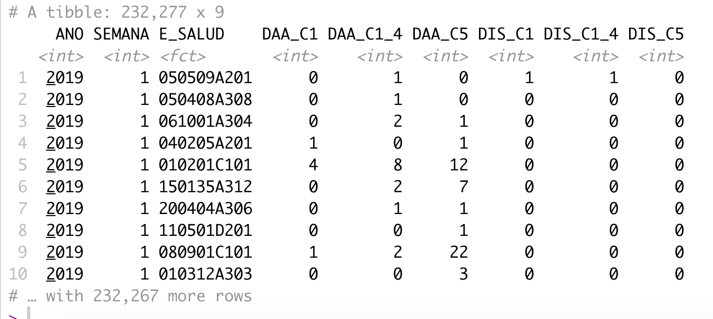

class: inverse, center, middle

```{r setup, include=FALSE}
knitr::opts_chunk$set(fig.dim=c(5.5, 4.5), 
                      # fig.retina=2, 
                      out.width="100%",
                      dev="svg")

library(dplyr)
library(ggplot2)
library(kableExtra)
library(tidyverse,warn.conflicts = F,verbose = F,quietly = T)
library(aweek)
```

```{r,echo=FALSE}
# install.packages("palmerpenguins")
pinguinos <- palmerpenguins::penguins %>% 
  filter(!is.na(bill_length_mm)) %>% 
  select(-flipper_length_mm,-body_mass_g)

data_covid <- read_csv("data/positivos_covid_short.csv",col_types = cols())

# load("data/tvseries_must_watch.rda")
# df <- tvseries_must_watch
# df <- df[!is.na(df$average_rating),] # Remove rows with NA average
```

```{r,eval=FALSE,echo=FALSE}
# <!-- # What is `ggplot2` -->
# 
# <!-- --- -->
# <!-- class: left, top -->
# 
# <!-- ## Why `ggplot2`? -->
# <!-- **`ggplot2`** is a data visualization package for R developed by [Hadley Wickham](https://twitter.com/hadleywickham) that provides a structured approach to graphing.  -->
# 
# <!-- It is a part of the **`tidyverse`**, a collection of R packages that share an underlying design philosophy, grammar and data structures. -->
# 
# <!-- -- -->
# 
# <!-- .pull-left[ -->
# <!-- ### Pros -->
# <!-- + Standardized method for plotting. -->
# <!-- + Publication quality plots. -->
# <!-- + Allows creation of relatively complex plots with ease. -->
# <!-- + Dominant plotting package in R. -->
# 
# <!-- ```{r, echo=FALSE, out.width="40%", fig.align="center"} -->
# <!-- knitr::include_graphics("https://media.giphy.com/media/nsMPhWK6bfxHq/giphy.gif") -->
# <!-- ``` -->
# <!-- ] -->
# 
# <!-- -- -->
# 
# <!-- .pull-right[ -->
# <!-- ### Cons -->
# <!-- - Might be a little bit difficult to understand at the beginning. -->
# <!-- - Sometimes you might get lost between all the things you can change. -->
# 
# <!-- ```{r, echo=FALSE, out.width="40%", fig.align="center"} -->
# <!-- knitr::include_graphics("https://media.giphy.com/media/2FazgxLhFpYv4t93G/giphy.gif") -->
# <!-- ``` -->
# <!-- ] -->
# 
# <!-- --- -->
# <!-- class: left, top -->
# 
# <!-- ## Hands on!  -->
# <!-- ### The dataset -->
# 
# <!-- ```{r, eval=FALSE} -->
# <!-- # install.packages("devtools") # Install devtools -->
# <!-- # devtools::install_github("mireia-bioinfo/tvseries") # Install the package tvseries -->
# <!-- # df <- tvseries::tvseries_must_watch -->
# <!-- load("data/tvseries_must_watch.rda") -->
# <!-- df <- tvseries_must_watch -->
# <!-- df <- df[!is.na(df$average_rating),] # Remove rows with NA average rating -->
# <!-- ``` -->
# 
# <!-- ```{r, echo=FALSE} -->
# <!-- load("data/tvseries_must_watch.rda") -->
# <!-- df <- tvseries_must_watch -->
# <!-- df <- df[!is.na(df$average_rating),] # Remove rows with NA average rating -->
# <!-- df %>% -->
# <!--   kable("html", row.names=FALSE) %>% -->
# <!--   kable_styling(font_size = 10)  %>%  -->
# <!--   scroll_box(height = "300px") -->
# <!-- ``` -->

```

---
class: center, middle

# ¡Los personajes!

```{r, echo=FALSE, fig.cap="", out.width = '70%'}
knitr::include_graphics("https://allisonhorst.github.io/palmerpenguins/man/figures/lter_penguins.png")
```

---
class: center, middle

# ¡Las variables!

```{r, echo=FALSE, fig.cap="", out.width = '60%'}
knitr::include_graphics("https://raw.githubusercontent.com/SamanthaToet/intro-to-flexdashboard/master/culmen_depth.png")
```

---
class: inverse, center, middle

# La gramática de `ggplot2`

<!---------------------------------------- BUILDING PLOTS one layer at a time ----------------------------------->
---
layout: true
class: left, top

## Construyendo gráficos una capa por tiempo

---
.left-code[
```{r gg-canvas0,eval=FALSE}
pinguinos
```

### Data

]
.right-plot[
```{r gg-canvas00,echo=FALSE}
pinguinos %>% 
  kable("html", row.names=FALSE) %>% 
  kable_styling(font_size = 18)  %>%  
  scroll_box(height = "500px")
```
]


---
.left-code[
```{r gg-canvas1, fig.show="hide"}
ggplot(pinguinos)
```

### Data

]
.right-plot[
`)
]

---
.left-code[
```{r gg-canvas2, fig.show="hide"}
ggplot(pinguinos,
      aes(x=bill_length_mm, y=bill_depth_mm, 
          color=species)) 
  
```

#### Data
### Mapeos

]
.right-plot[
`)
]

---
.left-code[
```{r gg-canvas3, fig.show="hide",}
ggplot(pinguinos,
      aes(x=bill_length_mm, y=bill_depth_mm, 
          color=species)) +
    {{geom_point() }}
```

#### Data
#### Mapeos
### Geometrías
]
.right-plot[
`)
]

---
.left-code[
```{r gg-canvas4, fig.show="hide", tidy=FALSE}
ggplot(pinguinos,
      aes(x=bill_length_mm, y=bill_depth_mm, 
          color=species)) +
    geom_point() +
   {{scale_color_brewer(palette="Dark2") }}
```

.pull-left[
#### Data
#### Mapeos
#### Geometrías
### Escalas
]
.pull-right[]
]
.right-plot[
`)
]

---
.left-code[
```{r gg-canvas5, fig.show="hide", tidy=FALSE}
ggplot(pinguinos,
      aes(x=bill_length_mm, y=bill_depth_mm, 
          color=species)) +
    geom_point() +
    scale_color_brewer(palette="Dark2") +
   {{stat_summary(fun="mean", geom= "line") }}
```

.pull-left[
#### Data
#### Mapeos
#### Geometrías
#### Escalas
]
.pull-right[
### Transformaciones estadísticas
]
]
.right-plot[
`)
]

---
.left-code[
```{r gg-canvas6, fig.show="hide", tidy=FALSE}
ggplot(pinguinos,
      aes(x=bill_length_mm, y=bill_depth_mm, 
          color=species)) +
    geom_point() +
    scale_color_brewer(palette="Dark2") +
    stat_summary(fun="mean", geom= "line") + 
   {{coord_flip()}}
```

.pull-left[
#### Data
#### Mapeos
#### Geometrías
#### Escalas
]
.pull-right[
#### Transformaciones estadísticas
### Sistemas de coordenadas
]
]
.right-plot[
`)
]

---
.left-code[
```{r gg-canvas7, fig.show="hide", tidy=FALSE}
ggplot(pinguinos,
      aes(x=bill_length_mm, y=bill_depth_mm, 
          color=species)) +
    geom_point() +
    scale_color_brewer(palette="Dark2") +
    stat_summary(fun="mean", geom= "line") + 
    coord_flip() +
   {{facet_wrap(~species)}}
```

.pull-left[
#### Data
#### Mapeos
#### Geometrías
#### Escalas
]
.pull-right[
#### Transformaciones estadísticas
#### Sistemas de coordenadas
### Paneles (facet)
]
]
.right-plot[
`)
]

---
.left-code[
```{r gg-canvas8, fig.show="hide", tidy=FALSE}
ggplot(pinguinos,
      aes(x=bill_length_mm, y=bill_depth_mm, 
          color=species)) +
    geom_point() +
    scale_color_brewer(palette="Dark2") +
    stat_summary(fun="mean", geom= "line") + 
    coord_flip() +
    facet_wrap(~species) +
   {{theme_bw() + theme(legend.position="top")}}
```

.pull-left[
#### Data
#### Mapeos
#### Geometrías
#### Escalas
]
.pull-right[
#### Transformaciones estadísticas
#### Sistemas de coordenadas
#### Paneles (facet)
### Temas
]
]
.right-plot[
`)
]

---
.left-code[
```{r gg-canvas9, fig.show="hide", tidy=FALSE}
ggplot(pinguinos,
      aes(x=bill_length_mm, y=bill_depth_mm, 
          color=species)) +
    geom_point() +
    scale_color_brewer(palette="Dark2") +
    stat_summary(fun="mean", geom= "line") + 
    coord_flip() +
    facet_wrap(~species) +
    theme_bw() + theme(legend.position="top") +
   {{annotate("text", x=55, y=14.5, label="Pval")}}
```

.pull-left[
#### Data
#### Mapeos
#### Geometrías
#### Escalas
]
.pull-right[
#### Transformaciones estadísticas
#### Sistemas de coordenadas
#### Paneles (facet)
#### Temas
### Anotaciones
]
]
.right-plot[
`)
]


<!---------------------------------------- GGPLOT2 BASICS ----------------------------------->
---
layout: false
class: inverse, middle, center
# ¡Vamos a darle una mirada más de cerca!

---
layout: true
class: left, top

## `ggplot2` básico

---
class: highlight

.left-code[
```{r, eval=FALSE}
ggplot(pinguinos)
```

### Data

]
.right-plot[
`)
]

---

.left-column[

## Data
`ggplot()`

]

.right-column[

El primer paso para graficar es tener tu data en formato __"adecuado"__ (_"tidy"_ o _"limpio"_):

1. Cada __variable__ es una __columna__.
2. Cada __observación__ es una __fila__.

.pull-left[

#### Formato ancho ("sucio") 

ubigeo | casos_JOVEN | casos_ADULTO
-----|---------------|----------------
A	| 3	| 12
B | 6 |	56
C	| 8 |	2

]

.pull-right[

#### Formato largo ("limpio") 

ubigeo | EDAD | casos 
-----|---------|----------
A |	JOVEN | 3
B	| JOVEN | 6
C | JOVEN | 8
A	| ADULTO	| 12
B	| ADULTO	| 56
C	| ADULTO	| 2
]

__¿Por qué?__ ¡Cada columna será una __capa__ del gráfico!

(¿Cómo solucionarlo? ver [**aquí**](https://tidyr.tidyverse.org/reference/pivot_longer.html#examples) una alternativa)

]


---

.left-column[

## Data
`ggplot()`

]

.right-column[

El primer paso para graficar es tener tu data en formato __"limpio"__ (_"tidy"_):

1. Cada __variable__ es una __columna__.
2. Cada __observación__ es una __fila__.

.pull-left[

#### Formato ancho ("sucio") 

ubigeo | IRA_joven | NEU_adulto
-----|---------------|----------------
A	| 3	| 12
B | 6 |	56
C	| 8 |	2

]

.pull-right[

#### Formato largo ("limpio") 

ubigeo | EDAD | casos | Dx
-----|---------|----------|--------
A |	joven | 3 | IRA
B	| joven | 6 | IRA
C | joven | 8 | IRA
A	| adulto	| 12 | NEU
B	| adulto	| 56 | NEU
C	| adulto	| 2 | NEU
]

__¿Por qué?__ ¡Cada columna será una __capa__ del gráfico!

(¿Cómo solucionarlo? ver [**aquí**](https://tidyr.tidyverse.org/reference/pivot_longer.html#examples) una alternativa)

]


---

.left-column[

## Data
`ggplot()`

]

.right-column[

Data en formato __"limpio"__ (_"tidy"_):

1. Cada __variable__ es una __columna__.
2. Cada __observación__ es una __fila__.

__¿Reconoces esta base de datos?__


si __SU OBJETIVO__ es hacer un grafico del numero de casos de EDA (todos los grupos de edad y tipos de edad) por semana

__¿que opina del formato"?__

```{r, echo=FALSE, fig.cap="", out.width = '50%'}


```

 
]

---

.left-column[

## Data
`ggplot()`

]

.right-column[

Data en formato __"limpio"__ (_"tidy"_):

1. Cada __variable__ es una __columna__.
2. Cada __observación__ es una __fila__.

__¿Reconoces esta base de datos?__

si __SU OBJETIVO__ es hacer un grafico del numero de casos de EDA (todos los grupos de edad y tipos de edad) por semana

__¿que opina del formato"?__

```{r, echo=FALSE, fig.cap="", out.width = '50%'}
knitr::include_graphics("data/eda2019_long.PNG")

```
]


---

.left-column[

## Data
`ggplot()`

]

.right-column[

Data en formato __"limpio"__ (_"tidy"_):

1. Cada __variable__ es una __columna__.
2. Cada __observación__ es una __fila__.


```{r,echo=TRUE}
pinguinos
```


]

```{r,eval=FALSE,echo=FALSE}
# <!-- --- -->
# <!-- .left-column[ -->
# <!-- ## Data -->
# <!-- `ggplot()` -->
# <!-- ] -->
# 
# <!-- .right-column[ -->
# 
# <!-- The first step for plotting is having your data in a __tidy__ (aka long) format. What does this mean? -->
# 
# <!-- 1. Each __variable__ forms a __column__. -->
# <!-- 2. Each __observación__ forms a __row__. -->
# 
# <!-- You can convert data from **wide** to **long** format using `reshape2::melt()` -->
# <!-- ] -->
```


---
class: highlight

.left-code[
```{r eval=FALSE}
ggplot(pinguinos,
      aes(x=bill_length_mm, y=bill_depth_mm, 
          color=species)) 
  
```

#### Data
### Mapeos

]
.right-plot[
`)
]

---
.left-column[
### Data
## Mapeos
`aes()`
]

.right-column[
El argumento __mapping__ indica cómo mapeamos la __columna de datos__ a elementos visuales o parámetros:

- Variable 1 → **x**
- Variable 2 → **y**
- Variable 3 → **color**, fill, shape, etc.

Los __nombres de columna__:

- Deben especificarse __dentro de la función `aes()`__
- No requieren de comillas :)

Extra:

- La función `aes()` es una contracción de _"aesthetics"_, __Estética__ en español.

```{r,eval=FALSE}
{{ggplot(data = pinguinos, }}
       mapping = aes(x = bill_length_mm, 
                     y = bill_depth_mm, 
                     color = species))
```


]


---
.left-column[
### Data
## Mapeos
`aes()`
]

.right-column[
El argumento __mapping__ indica cómo mapeamos la __columna de datos__ a elementos visuales o parámetros:

- Variable 1 → **x**
- Variable 2 → **y**
- Variable 3 → **color**, fill, shape, etc.

Los __nombres de columna__:

- Deben especificarse __dentro de la función `aes()`__
- No requieren de comillas :)

Extra:

- La función `aes()` es una contracción de _"aesthetics"_, __Estética__ en español.

```{r,eval=FALSE}
{{ggplot(pinguinos, }}
       aes(x = bill_length_mm, 
           y = bill_depth_mm, 
           color = species))
```


]


---
class: highlight

.left-code[
```{r eval=FALSE}
ggplot(pinguinos,
      aes(x=bill_length_mm, y=bill_depth_mm, 
          color=species)) +
    {{geom_point() }}
```

#### Data
#### Mapeos
### Geometrías
]
.right-plot[
`)
]

---
.left-column[
### Data
### Mapeos
## Geometrías
`geom_*()`
]

.right-column[
Las **geometrías** indican cuáles formas geométricas deben ser graficadas usando los parámetros y variables definidas en `aes()`.

```{r geom-point, include=FALSE, fig.show="hide", fig.dim=c(1, .25), dev="svg"} 
ggplot(pinguinos, aes(bill_length_mm, bill_depth_mm, color=species)) +
  geom_point(size=.1) +
  theme_void() + theme(legend.position="none")
```

```{r geom-line, include=FALSE, fig.show="hide", fig.dim=c(1, .25), dev="svg"} 
ggplot(pinguinos, aes(bill_length_mm, bill_depth_mm, color=species)) +
  stat_summary(fun="mean", geom="line") +
  theme_void() + theme(legend.position="none")
```

```{r geom-bar, include=FALSE, fig.show="hide", fig.dim=c(1, .25), dev="svg"} 
ggplot(pinguinos[round(runif(70, min=1, max=nrow(pinguinos))),], aes(species, ..count.., fill=species)) +
  geom_bar() +
  theme_void() + theme(legend.position="none")
```

```{r geom-hist, include=FALSE, fig.show="hide", fig.dim=c(1, .25), dev="svg"} 
ggplot(pinguinos, aes(bill_length_mm, fill=species)) +
  geom_histogram() +
  theme_void() + theme(legend.position="none")
```

```{r geom-smooth, include=FALSE, fig.show="hide", fig.dim=c(1, .25), dev="svg"} 
ggplot(pinguinos, aes(bill_length_mm, bill_depth_mm, color=species)) +
  geom_smooth() +
  theme_void() + theme(legend.position="none")
```

```{r geom-box, include=FALSE, fig.show="hide", fig.dim=c(1, .25), dev="svg"} 
ggplot(pinguinos, aes(species, bill_depth_mm, fill=species, color=species)) +
  geom_boxplot() +
  theme_void() + theme(legend.position="none")
```

Tipo       | Función           | Imagen
-----------|--------------------|-----------------------------------------------
Punto      | `geom_point()`     | `)
Linea       | `geom_line()`      | `)
Barra        | `geom_bar()`       | `)
Histograma  | `geom_histogram()` | `)
Regresión | `geom_smooth()`    | `)
Cajas    | `geom_boxplot()`   | `)
]

---
.left-column[
### Data
### Mapeos
## Geometrías
`geom_*()`
]

.right-column[
Estas son algunas de las __funciones `geom_*`__ disponibles:

```{r, echo=FALSE}
lsf.str("package:ggplot2") %>% grep("^geom_", ., value = TRUE)
```
]

---
.left-column[
### Data
### Mapeos
## Geometrías
`geom_*()`
]

.right-column[
**¡Recomendamos en un 100% usar las "Hojas de Plagio" o [Cheatsheets (ver)](https://drive.google.com/file/d/1Mz_uNvvlH9grqIRe8S_xeYe3ag3G5Sv8/view?usp=sharing)!**

```{r, echo=FALSE, fig.cap="", out.width = '100%'}
knitr::include_graphics("data/ggplot-hoja.PNG")
```

]

---
layout: true
class: left, top

## `ggplot2` básico


---
class: highlight

.left-code[
```{r eval=FALSE}
ggplot(pinguinos,
      aes(x=bill_length_mm, y=bill_depth_mm, 
          color=species)) +
    {{geom_point() }}
```

#### Data
#### Mapeos
### Geometrías
]
.right-plot[
`)
]


---
.left-column[
### Data
### Mapeos
## Geometrías
`geom_*()`
]

.right-column[
Puedes definir __Mapeos__ para:
- el **gráfico completo** incluyéndolo en la función `ggplot()`.
- una **geometría específica** incluyéndolo en la función `geom_xxx()`.

```{r,eval=FALSE}
A <- ggplot(pinguinos, aes(x = bill_length_mm, y = bill_depth_mm, 
                    {{color=species)) +}}
     geom_point() + 
     geom_line()
#.
#.
#.
#.
```

```{r mapeo01,echo=FALSE,include=FALSE, fig.show="hide", fig.dim=c(4.3, 2), dev="svg"}
# para gráfico completo o global
a <- ggplot(pinguinos, aes(x = bill_length_mm, y = bill_depth_mm, color=species)) +
  geom_point() + 
  geom_line() +
  theme_void() +
  theme(#legend.position="bottom",
        legend.title = element_blank())
b <- ggplot(pinguinos, aes(x = bill_length_mm, y = bill_depth_mm)) +
  geom_point() + 
  geom_line(aes(color=species)) +
  theme_void() +
  theme(#legend.position="bottom",
        legend.title = element_blank())
library(patchwork)
a + labs(title = "(A) mapeo global")
```

`)

]


---
.left-column[
### Data
### Mapeos
## Geometrías
`geom_*()`
]

.right-column[
Puedes definir __Mapeos__ para:
- el **gráfico completo** incluyéndolo en la función `ggplot()`.
- una **geometría específica** incluyéndolo en la función `geom_xxx()`.

```{r,eval=FALSE}
A <- ggplot(pinguinos, aes(x = bill_length_mm, y = bill_depth_mm, 
                    {{color=species)) +}}
     geom_point() + 
     geom_line()

B <- ggplot(pinguinos, aes(x = bill_length_mm, y = bill_depth_mm)) +
     geom_point() +
   {{geom_line(aes(color=species))}}
```

```{r mapeo01b,echo=FALSE,include=FALSE, fig.show="hide", fig.dim=c(8.6, 2), dev="svg"}
# para gráfico completo o global
a <- ggplot(pinguinos, aes(x = bill_length_mm, y = bill_depth_mm, color=species)) +
  geom_point() + 
  geom_line() +
  theme_void() +
  theme(#legend.position="bottom",
        legend.title = element_blank())
b <- ggplot(pinguinos, aes(x = bill_length_mm, y = bill_depth_mm)) +
  geom_point() + 
  geom_line(aes(color=species)) +
  theme_void() +
  theme(#legend.position="bottom",
        legend.title = element_blank())
library(patchwork)
a + labs(title = "(A) mapeo global") +
  (b + labs(title = "(B) mapeo específico"))
```

`)

]


---
layout: false
class: inverse, middle, center

# ¡Tiempo para algunos ejemplos y ejercicios!


---
layout: true
class: left, top

## Aplicación 1 

---
.left-code[
### Grafique un __Diagrama de Columnas__ con el "Número de Casos" por cada Semana Epidemiológica ("SE") a nivel Nacional

1. _Usar_ data_covid.
1. _Retirar_ filas con edades negativas.
1. _Calcular_ la "SE" usando la fecha de resultados.
1. _Calcular_ la cantidad de casos por cada "SE".
1. _Transformar_ la variable "SE" a clase factor.
1. **Mapear x: "SE" y: "Número de Casos"**
1. **Usar la geometría `geom_col()`**

```{r, fig.show="hide",eval=FALSE,echo=TRUE}
# library(tidyverse); install.packages(aweek); library(aweek)
data_covid %>% 
  filter(EDAD >= 0) %>% 
  mutate(SEMANA_EPI = date2week(FECHA_RESULTADO, #<<
                                floor_day = TRUE, #<<
                                week_start = "Sunday")) %>% #<<
  count(SEMANA_EPI) %>% 
  mutate(SEMANA_EPI = as.factor(SEMANA_EPI))
```

]
.right-plot[

```{r,eval=TRUE,echo=FALSE}
data_covid %>% 
  filter(EDAD >= 0) %>% 
  mutate(SEMANA_EPI = date2week(FECHA_RESULTADO, 
                                floor_day = TRUE, 
                                week_start = "Sunday")) %>% 
  count(SEMANA_EPI) %>% 
  mutate(SEMANA_EPI = as.factor(SEMANA_EPI))
```


]

---
layout: true
class: left, top

## Aplicación 1 

---
.left-code[
### Grafique un __Diagrama de Columnas__ con el "Número de Casos" por cada Semana Epidemiológica ("SE") a nivel Nacional

1. _Retirar_ filas con edades negativas.
1. _Calcular_ la "SE" usando la fecha de resultados.
1. _Calcular_ la cantidad de casos por cada "SE".
1. _Transformar_ la variable "SE" a clase factor.
1. **Mapear x: "SE" y: "Número de Casos"**
1. **Usar la geometría `geom_col()`**

```{r example-1, fig.show="hide",warning=FALSE,message=FALSE}
# library(tidyverse); install.packages(aweek); library(aweek)
data_covid %>% 
  filter(EDAD >= 0) %>% 
  mutate(SEMANA_EPI = date2week(FECHA_RESULTADO, 
                                floor_day = TRUE,
                                week_start = "Sunday")) %>% 
  count(SEMANA_EPI) %>% 
  mutate(SEMANA_EPI = as.factor(SEMANA_EPI)) %>% 
  ggplot(aes(x = SEMANA_EPI,y = n)) #<<
```

]
.right-plot[
`)
]

---
layout: true
class: left, top

## Aplicación 1 

---
.left-code[
### Grafique un __Diagrama de Columnas__ con el "Número de Casos" por cada Semana Epidemiológica ("SE") a nivel Nacional

1. _Retirar_ filas con edades negativas.
1. _Calcular_ la "SE" usando la fecha de resultados.
1. _Calcular_ la cantidad de casos por cada "SE".
1. _Transformar_ la variable "SE" a clase factor.
1. **Mapear x: "SE" y: "Número de Casos"**
1. **Usar la geometría `geom_col()`**

```{r example-10, fig.show="hide",warning=FALSE,message=FALSE}
# library(tidyverse); install.packages(aweek); library(aweek)
data_covid %>% 
  filter(EDAD >= 0) %>% 
  mutate(SEMANA_EPI = date2week(FECHA_RESULTADO,
                                floor_day = TRUE,
                                week_start = "Sunday")) %>% 
  count(SEMANA_EPI) %>% 
  mutate(SEMANA_EPI = as.factor(SEMANA_EPI)) %>% 
  ggplot(aes(x = SEMANA_EPI,y = n)) +
  geom_col() #<<
```

]
.right-plot[
`)
]


---
layout: false
class: inverse, center, middle

#Fin

```{r, out.width="50%", echo=FALSE}
knitr::include_graphics("https://media.giphy.com/media/QW5nKIoebG8y4/giphy.gif")
```


---
layout: false
class: inverse, middle, center

